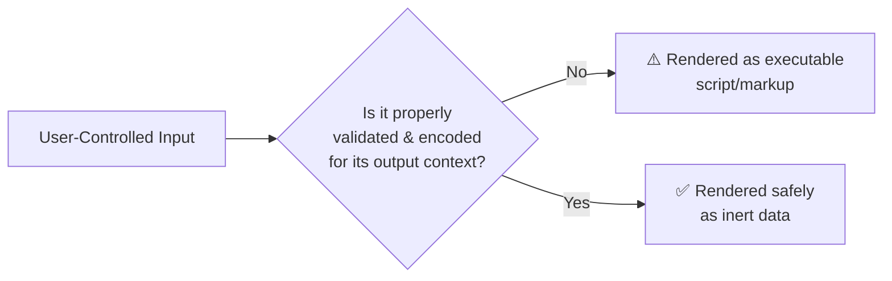
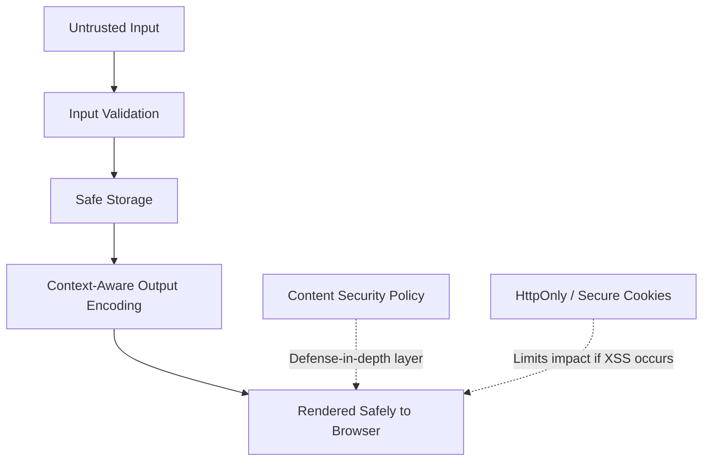

<div align="center">

# 🛡️ Cross-Site Scripting (XSS) — Defensive Security Study Guide

### *Understanding, Recognizing, and Preventing XSS in Modern Web Applications*


**A structured, ethical, education-first resource for understanding Cross-Site Scripting (XSS) — how it happens, why it matters, and how to prevent it.**

`Audience: Developers · Security Students · AppSec Engineers` · `Level: Beginner → Intermediate`

</div>

---

## 📚 Table of Contents

- [Overview](#-overview)
- [Learning Objectives](#-learning-objectives)
- [Repository Structure](#-repository-structure)
- [What is XSS?](#-what-is-xss)
- [Types of XSS](#-types-of-xss)
  - [Reflected XSS](#reflected-xss)
  - [Stored XSS](#stored-xss)
  - [DOM-Based XSS](#dom-based-xss)
- [Common Causes](#-common-causes)
- [Potential Impact](#-potential-impact)
- [Prevention Best Practices](#-prevention-best-practices)
- [Secure Development Checklist](#-secure-development-checklist)
- [Recommended Safe Practice Platforms](#-recommended-safe-practice-platforms)
- [References](#-references)
- [License](#-license)
- [Disclaimer](#-disclaimer)

---

## 🧾 Overview

**Cross-Site Scripting (XSS)** is one of the most persistent and well-known web application vulnerabilities, consistently featured in the **OWASP Top 10**. It occurs when an application includes untrusted data in a web page without proper validation or escaping, allowing that data to be interpreted and executed as code by a victim's browser.

**Why developers should understand XSS:**

- It remains one of the most commonly reported vulnerability classes in real-world bug bounty and penetration testing reports.
- It can affect *any* application that renders user-influenced content — forms, comments, URLs, file uploads, and even HTTP headers.
- Understanding XSS is foundational to understanding broader concepts like trust boundaries, output encoding, and the browser's execution model.

**Why prevention matters:**

Preventing XSS isn't just about avoiding a single bug class — it builds the habit of treating all external input as untrusted, which strengthens an application's overall security posture and protects end users from having their sessions, data, or trust compromised.

> **📌 Note**
> This repository focuses exclusively on **understanding and preventing** XSS. It intentionally does not include exploit payloads, attack scripts, or techniques for compromising real systems. See the [Disclaimer](#-disclaimer) for full scope and intent.

---

## 🎯 Learning Objectives

By studying this repository, you should be able to:

- ✅ Understand what Cross-Site Scripting (XSS) is and why it exists
- ✅ Differentiate between Reflected, Stored, and DOM-Based XSS
- ✅ Recognize common coding patterns and architectural decisions that lead to XSS
- ✅ Understand the real-world impact of XSS on users and organizations
- ✅ Apply context-aware output encoding and modern sanitization techniques
- ✅ Implement defense-in-depth mitigations, including Content Security Policy (CSP)
- ✅ Integrate secure coding and testing practices into the development lifecycle
- ✅ Identify legal, purpose-built platforms for hands-on defensive practice

---

## 📁 Repository Structure

```
xss-security-study-guide/
│
├── docs/          # In-depth write-ups, notes, and study summaries
├── labs/          # Notes/configs for practicing on legal, sandboxed lab platforms
├── diagrams/       # Visual explanations of XSS concepts and data flow
├── examples/        # Secure vs. insecure code PATTERNS (conceptual, non-exploitable)
├── resources/         # Curated links, cheat sheets, and further reading
├── README.md
└── LICENSE
```

> **💡 Tip**
> The `examples/` folder is intended for **conceptual, defensive code comparisons only** (e.g., "insecure pattern" vs. "secure pattern" at a structural level) — not working exploit code. See [Prevention Best Practices](#-prevention-best-practices) for the kind of content that belongs there.

---

## ❓ What is XSS?

Cross-Site Scripting (XSS) is a type of **injection vulnerability** in which an attacker is able to introduce untrusted content into a web page such that it is executed by a victim's browser in the context of a trusted site.

Because a browser has no reliable way to distinguish "content the developer intended" from "content an attacker managed to inject," anything that ends up in the page — including script — can potentially execute with the same trust and permissions as the legitimate site.

At its core, XSS is a **failure to separate data from code**. Whenever user-influenced data is rendered into a page (HTML, JavaScript, an attribute, a URL, etc.) without being properly encoded for that specific context, there is a risk that the browser will interpret part of that data as executable code rather than as plain text.



> **🔑 Key takeaway:** XSS is fundamentally a **context problem**. The same string might be perfectly safe in one location on a page (like a database log) and dangerous in another (like directly inside an HTML `<script>` block).

---

## 🧬 Types of XSS

### Reflected XSS

**Overview**
Reflected XSS occurs when untrusted input is immediately included in a server's response — without being stored — such as a search term echoed back on a "results for..." page. The malicious behavior only occurs when the crafted input is submitted or a crafted link is followed.

**Typical Scenario**
A web application takes a URL parameter (for example, a search query or an error message) and reflects it directly back into the HTML response without appropriate output encoding. Because the data is not stored, an attacker generally needs to induce a victim to interact with a specially crafted link or form.

**Risk**
Reflected XSS is often used in targeted, single-victim scenarios (e.g., a crafted link shared with a specific user) rather than affecting all visitors automatically.

**Mitigation**
- Apply context-aware output encoding to any value reflected into a response
- Validate and constrain input formats where possible (allow-lists over deny-lists)
- Adopt a strong Content Security Policy to limit the impact of any script that does execute

---

### Stored XSS

**Overview**
Stored (also called "Persistent") XSS occurs when untrusted input is saved by the application — for example, in a database, comment field, or user profile — and later rendered to other users without proper encoding.

**Risk**
Because the payload is persisted and served to every user who views the affected content, stored XSS is generally considered more severe than reflected XSS: it does not require tricking an individual victim into clicking a specific link, and it can affect many users, including administrators.

**Mitigation**
- Encode data appropriately at the point of **output**, not just at the point of input
- Apply strict server-side validation and sanitization for any content that will later be rendered as HTML
- Use allow-list-based HTML sanitization libraries when rich text (e.g., formatted comments) must be supported
- Apply the Principle of Least Privilege to reduce the impact of a compromised account

---

### DOM-Based XSS

**Overview**
DOM-Based XSS occurs entirely on the client side, when JavaScript takes data from an untrusted source (such as the URL, `document.referrer`, or `window.name`) and passes it to a "sink" that can interpret it as HTML or executable code — without the data ever necessarily passing through the server.

**Risk**
DOM-based XSS can be harder to detect with traditional server-side scanning tools because the vulnerable data flow exists entirely within client-side JavaScript execution.

**Mitigation**
- Avoid unsafe DOM sinks (such as directly assigning untrusted data to properties that render HTML) in favor of safer alternatives that treat data as text, not markup
- Use browser and framework APIs designed to insert content safely as text rather than as parsed HTML
- Apply Content Security Policy (CSP) as a defense-in-depth control
- Keep front-end frameworks and their built-in escaping mechanisms up to date, and avoid disabling their default protections

> **⚠️ Note**
> This section intentionally avoids naming specific vulnerable functions as "how-to" instructions. Consult the [OWASP DOM-Based XSS Prevention Cheat Sheet](#-references) for authoritative, developer-focused technical guidance on safe vs. unsafe DOM APIs.

---

## 🧩 Common Causes

| Cause | Description |
|---|---|
| **Improper Input Validation** | Accepting data without verifying it conforms to an expected format, type, or length |
| **Unsafe DOM Manipulation** | Using client-side APIs that interpret strings as HTML/markup rather than plain text |
| **Missing Output Encoding** | Rendering user-influenced data into HTML, attributes, JavaScript, or URLs without encoding it for that specific context |
| **Lack of Sanitization** | Allowing rich-text or HTML input without passing it through a vetted, allow-list-based sanitizer |
| **Insecure JavaScript Usage** | Dynamically constructing markup or scripts from untrusted strings instead of using safe, structured APIs |
| **Over-Trusting Third-Party Content** | Rendering content from external APIs, widgets, or integrations as if it were fully trusted |
| **Disabled Framework Protections** | Turning off a modern framework's built-in auto-escaping "because it was inconvenient" |

---

## 💥 Potential Impact

XSS is not a single fixed outcome — its impact depends heavily on the application, the victim's privileges, and what the injected script is able to interact with. At a high level, potential consequences include:

- **Unauthorized script execution** in the context of a trusted site, undermining the browser's same-origin protections for that page
- **Session or account compromise**, depending on how the application manages authentication
- **Phishing and social engineering**, by altering page content to deceive users
- **Website defacement**, damaging user trust and brand reputation
- **Loss of user trust and regulatory/compliance consequences** for the affected organization

> **🚫 Scope note:** This guide deliberately does **not** walk through the technical mechanics of exploiting these impacts. The focus here is on recognizing *why* these outcomes are possible so that they can be designed against.

---

## 🔐 Prevention Best Practices

| Practice | Why It Matters |
|---|---|
| **Context-Aware Output Encoding** | Encode data differently depending on where it's rendered — HTML body, HTML attribute, JavaScript, CSS, or URL — since each context has different special characters |
| **Input Validation** | Constrain input to expected formats using allow-lists (what *is* permitted) rather than deny-lists (trying to block what's dangerous) |
| **HTML Sanitization** | When rich HTML input must be accepted, use a well-maintained, allow-list-based sanitization library rather than writing custom filtering logic |
| **Content Security Policy (CSP)** | Configure a strict CSP (e.g., restricting script sources, disallowing inline scripts) as a defense-in-depth layer that limits the impact of any script that does execute |
| **HttpOnly & Secure Cookies** | Mark sensitive cookies `HttpOnly` and `Secure` so they cannot be accessed via client-side script and are only sent over HTTPS |
| **Use Modern, Secure Frameworks Correctly** | Rely on the built-in escaping of frameworks like React, Angular, or Vue, and avoid bypassing it (e.g., "raw HTML" or "trust this string" APIs) without strong justification and additional sanitization |
| **Security Testing** | Incorporate static analysis (SAST), dynamic analysis (DAST), and manual code review into the development pipeline to catch encoding gaps early |
| **Code Reviews** | Treat any code that renders user-influenced data as a review priority, with a checklist focused on output context and encoding |
| **Least Privilege & Defense-in-Depth** | Assume some vulnerabilities will slip through, and design systems (session handling, permissions, CSP) so that a single XSS finding has limited blast radius |



---

## ✅ Secure Development Checklist

- [ ] All user-influenced data is encoded appropriately for its output context (HTML, attribute, JS, URL, CSS)
- [ ] Input validation uses allow-lists wherever feasible
- [ ] Rich-text/HTML input is processed through a maintained, allow-list-based sanitizer
- [ ] A strict Content Security Policy is defined and enforced
- [ ] Sensitive cookies are flagged `HttpOnly` and `Secure`
- [ ] Framework auto-escaping is enabled and not bypassed without justification
- [ ] Third-party widgets/scripts are reviewed and scoped appropriately
- [ ] SAST/DAST tooling is integrated into the CI/CD pipeline
- [ ] Code reviews explicitly check output-encoding correctness
- [ ] Developers receive periodic secure coding training on injection-class vulnerabilities
- [ ] Incident response plans account for potential XSS-related reports (e.g., via a responsible disclosure/bug bounty program)

---

## 🧪 Recommended Safe Practice Platforms

Hands-on practice should **only** take place on legal, purpose-built platforms designed for this kind of learning — never against systems you do not own or have explicit written authorization to test.

| Platform | Description |
|---|---|
| **[OWASP WebGoat](https://owasp.org/www-project-webgoat/)** | A deliberately insecure application maintained by OWASP for learning common web vulnerabilities in a safe, local environment |
| **[OWASP Juice Shop](https://owasp.org/www-project-juice-shop/)** | A modern, intentionally vulnerable web application covering the OWASP Top 10, runnable locally via Docker |
| **[PortSwigger Web Security Academy](https://portswigger.net/web-security)** | A free, structured, hands-on learning platform with interactive labs specifically covering XSS and other vulnerability classes |
| **[DVWA (Damn Vulnerable Web Application)](https://github.com/digininja/DVWA)** | A PHP/MySQL application intentionally vulnerable, intended for local lab use only |
| **[bWAPP](http://www.itsecgames.com/)** | A free and open-source deliberately vulnerable web application for practicing a wide range of vulnerabilities |

> **⚠️ Important:** Always run these labs **locally or in an isolated, sandboxed environment** (e.g., a local VM or Docker container). Never deploy intentionally vulnerable applications on a publicly accessible server.

---

## 🔗 References

| Resource | Link |
|---|---|
| OWASP – Cross Site Scripting | [owasp.org/www-community/attacks/xss/](https://owasp.org/www-community/attacks/xss/) |
| OWASP XSS Prevention Cheat Sheet | [cheatsheetseries.owasp.org](https://cheatsheetseries.owasp.org/cheatsheets/Cross_Site_Scripting_Prevention_Cheat_Sheet.html) |
| PortSwigger Web Security Academy – XSS | [portswigger.net/web-security/cross-site-scripting](https://portswigger.net/web-security/cross-site-scripting) |
| MDN Web Docs – Website Security | [developer.mozilla.org](https://developer.mozilla.org/en-US/docs/Web/Security) |
| CWE-79: Improper Neutralization of Input During Web Page Generation | [cwe.mitre.org/data/definitions/79.html](https://cwe.mitre.org/data/definitions/79.html) |

---

## 📄 License

This project is licensed under the **MIT License** — see the [LICENSE](LICENSE) file for details.

---

## ⚖️ Disclaimer

> This repository is created **solely for educational purposes, defensive cybersecurity learning, secure software development, and ethical security research**. It does not promote or encourage unauthorized access, exploitation, or misuse of computer systems. Always obtain proper authorization before testing any application, and only practice on systems you own or are explicitly permitted to test, such as the platforms listed in [Recommended Safe Practice Platforms](#-recommended-safe-practice-platforms).
